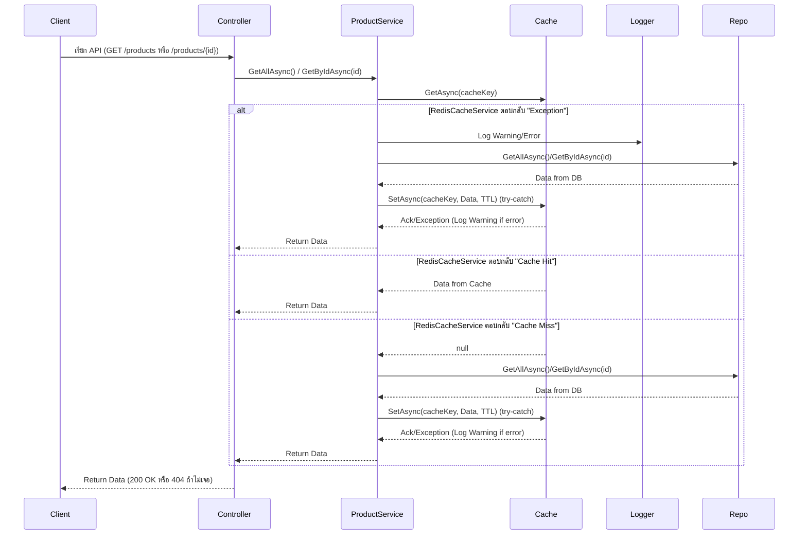
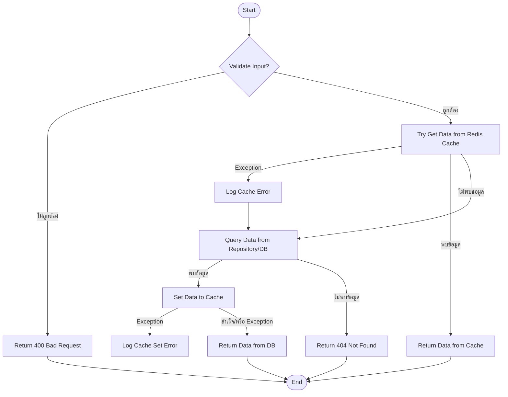
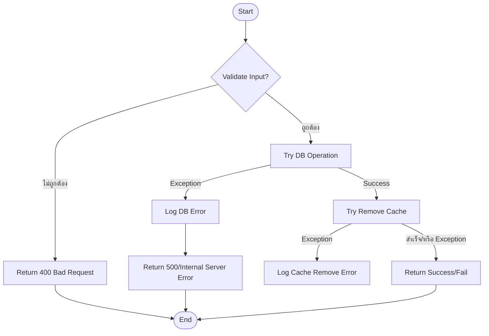

 
# พัฒนา Web API ด้วย .NET 8 พร้อม Redis Cache, Serilog Logging และระบบ Centralized Log Monitoring ด้วย Seq


**พัฒนา Web API ด้วย .Net8 รองรับ Redis Cache, Logging ด้วย Serilog และ Monitoring ผ่าน Seq**

---

## **คุณสมบัติ**

* โครงสร้าง Clean Architecture (แบ่งชั้นชัดเจน)
* Dapper ORM (เร็ว, เข้าใจง่าย)
* รองรับ Redis Cache (StackExchange.Redis)
* MSSQL LocalDB ใช้งานง่าย
* Global Exception Middleware (จับ error/log อัตโนมัติ)
* Response Wrapper (ApiResponse<T>)
* Serilog Logging (พร้อมต่อกับ Seq, File, Console ฯลฯ)
* ใช้ Docker Compose สำหรับ Redis, Seq
* DI เต็มรูปแบบ (Testable, ขยายง่าย)

---

## **Project Structure**

```
ProductAPIRedisCache/      # ASP.NET Core WebAPI Project
│
├── Api/                   # Controllers Layer
│   └── Controllers/
│       └── ProductController.cs
├── Application/           # Application Layer (Services, Interfaces)
│   ├── Interfaces/
│   │   └── IProductService.cs
│   └── Services/
│       └── ProductService.cs
├── Domain/                # Domain Entities, Interfaces
│   ├── Entities/
│   │   └── Product.cs
│   └── Interfaces/
│       └── IProductRepository.cs
├── Infrastructure/        # Repository, Database, Redis, Cache
│   ├── Cache/
│   │   ├── IRedisCacheService.cs
│   │   └── RedisCacheService.cs
│   └── Repositories/
│       └── ProductRepository.cs
├── Common/                # Utilities (ApiResponse, Middleware)
│   ├── ApiErrorResponse.cs
│   └── ApiResponse.cs
├── Middleware/
│   └── ExceptionMiddleware.cs
├── README.md
└── docker-compose.yml
```

---

## **ขั้นตอน**

### **1. ติดตั้ง Package ที่ต้องใช้**

```sh
dotnet add package Dapper
dotnet add package Microsoft.Data.SqlClient
dotnet add package StackExchange.Redis
dotnet add package Serilog.AspNetCore
dotnet add package Serilog.Sinks.Console
dotnet add package Serilog.Sinks.Seq
```

---

### **2. สร้าง Table MSSQL สำหรับ Product**

```sql
CREATE DATABASE ProductDb;

CREATE TABLE Products (
    Id INT PRIMARY KEY IDENTITY,
    Name NVARCHAR(100) NOT NULL,
    Price DECIMAL(18,2) NOT NULL,
    Stock INT NOT NULL,
    CreatedAt DATETIME NOT NULL,
    UpdatedAt DATETIME NULL
);
```

---

### **3. Docker Compose สำหรับ Redis + Seq**

**docker-compose.yml**

```yaml
version: '3.9'
services:
  redis:
    image: "redis:7.2"
    container_name: "my-redis"
    ports:
      - "6379:6379"
    restart: always

  seq:
    image: datalust/seq
    container_name: seq
    environment:
      - ACCEPT_EULA=Y
    ports:
      - "5341:80"
    volumes:
      - seqdata:/data
    restart: always

volumes:
  seqdata:
```

**รัน**

```sh
docker-compose up -d
```
* โดย: 
* Redis: ใช้โปรแกรม RedisInsight ตรวจสอบ cache ตามแสดงในข้อ 10.  
* Seq (ดู log): [http://localhost:5341](http://localhost:5341) ตามแสดงในข้อ 9.

---

### **4. ตั้งค่า Connection String ใน `appsettings.json`**

```json
"ConnectionStrings": {
  "DefaultConnection": "Server=(localdb)\\mssqllocaldb;Database=ProductDb;Trusted_Connection=True;"
}
```

---

### **5. ตัวอย่างการ Register DI และ Serilog ใน `Program.cs`**

```csharp
using Serilog;
using StackExchange.Redis;
using ProductAPI.Common;
using ProductAPI.Infrastructure.Cache;
using ProductAPI.Infrastructure.Database;
using ProductAPI.Infrastructure.Repositories;
using ProductAPI.Application.Services;
using ProductAPI.Application.Interfaces;
using ProductAPI.Domain.Interfaces;

Log.Logger = new LoggerConfiguration()
    .Enrich.FromLogContext()
    .WriteTo.Console()
    .WriteTo.Seq("http://localhost:5341")
    .CreateLogger();

builder.Host.UseSerilog();

builder.Services.AddControllers();
builder.Services.AddScoped<IDbConnectionFactory, SqlConnectionFactory>();
builder.Services.AddScoped<IProductRepository, ProductRepository>();
builder.Services.AddScoped<IProductService, ProductService>();
builder.Services.AddSingleton<IConnectionMultiplexer>(_ => ConnectionMultiplexer.Connect("localhost:6379"));
builder.Services.AddSingleton<IRedisCacheService, RedisCacheService>();

var app = builder.Build();

// Global Exception Middleware
app.UseMiddleware<ExceptionMiddleware>();

app.MapControllers();
app.Run();
```

---

### **6. ตัวอย่างโค้ด ApiResponse (Record) และ ExceptionMiddleware**

**Common/ApiResponse.cs**

```csharp
namespace ProductAPI.Common;

public record ApiResponse<T>(bool Success, string? Message, T? Data)
{
    public static ApiResponse<T> Ok(T data, string? message = null)
        => new(true, message, data);

    public static ApiResponse<T> Fail(string? message = null)
        => new(false, message, default);
}
```

**Common/ExceptionMiddleware.cs**

```csharp
using System.Net;
using System.Text.Json;
using ProductAPI.Common;

public class ExceptionMiddleware(RequestDelegate next, ILogger<ExceptionMiddleware> logger)
{
    public async Task InvokeAsync(HttpContext context)
    {
        try
        {
            await next(context);
        }
        catch (Exception ex)
        {
            logger.LogError(ex, "Unhandled exception: {Message}", ex.Message);

            context.Response.ContentType = "application/json";
            context.Response.StatusCode = ex switch
            {
                ArgumentNullException or ArgumentException => (int)HttpStatusCode.BadRequest,
                KeyNotFoundException => (int)HttpStatusCode.NotFound,
                _ => (int)HttpStatusCode.InternalServerError
            };

            var message = context.Response.StatusCode == 404
                ? "Resource not found."
                : "Internal server error. Please contact support.";

            var response = ApiResponse<string>.Fail(message);
            await context.Response.WriteAsync(JsonSerializer.Serialize(response));
        }
    }
}
```

---
### **7. ตัวอย่าง Code ...

#### **7.1 ตัวอย่าง Controller**

```csharp
[ApiController]
[Route("api/[controller]")]
public class ProductController(IProductService service) : ControllerBase
{
    [HttpGet]
    public async Task<IActionResult> GetAll()
    {
        var products = await service.GetAllAsync();
        return Ok(ApiResponse<IEnumerable<Product>>.Ok(products));
    }

    [HttpGet("{id}")]
    public async Task<IActionResult> Get(int id)
    {
        var product = await service.GetByIdAsync(id);
        if (product is null)
            return NotFound(ApiResponse<Product>.Fail("Product not found."));
        return Ok(ApiResponse<Product>.Ok(product));
    }

    [HttpPost]
    public async Task<IActionResult> Create([FromBody] Product product)
    {
        var id = await service.CreateAsync(product);
        return CreatedAtAction(nameof(Get), new { id }, ApiResponse<int>.Ok(id, "Product created."));
    }

    [HttpPut("{id}")]
    public async Task<IActionResult> Update(int id, [FromBody] Product product)
    {
        product.Id = id;
        var result = await service.UpdateAsync(product);
        if (!result)
            return NotFound(ApiResponse<Product>.Fail("Product not found."));
        return Ok(ApiResponse<bool>.Ok(true, "Product updated."));
    }

    [HttpDelete("{id}")]
    public async Task<IActionResult> Delete(int id)
    {
        var result = await service.DeleteAsync(id);
        if (!result)
            return NotFound(ApiResponse<Product>.Fail("Product not found."));
        return Ok(ApiResponse<bool>.Ok(true, "Product deleted."));
    }
}
```
#
#### **7.2 ตัวอย่าง Service **

```csharp
namespace ProductAPIRedisCache.Application.Services
{
    public class ProductService(IProductRepository repo, IRedisCacheService cache) : IProductService
    { 
        public async Task<IEnumerable<Product>> GetAllAsync()
        {
            var cacheKey = "products_all";
            var cached = await cache.GetAsync<IEnumerable<Product>>(cacheKey);
            if (cached is not null)
                return cached;

            var products = await repo.GetAllAsync();
            await cache.SetAsync(cacheKey, products, TimeSpan.FromMinutes(2));
            return products;
        }
         
        public async Task<Product?> GetByIdAsync(int id)
        {
            //throw new Exception("Test Exception: Service Layer!");

            var cacheKey = $"product_{id}";
            var cached = await cache.GetAsync<Product>(cacheKey);
            if (cached is not null)
                return cached;

            var product = await repo.GetByIdAsync(id);
            if (product is not null)
                await cache.SetAsync(cacheKey, product, TimeSpan.FromMinutes(2));
            return product;
        }

         
        public async Task<Product> CreateAsync(Product product)
        {
            var prod = await repo.CreateAsync(product);
          
            await cache.RemoveAsync("products_all");
            return prod;
        }
         
        public async Task<bool> UpdateAsync(Product product)
        {
            var result = await repo.UpdateAsync(product);
            await cache.RemoveAsync("products_all");
            await cache.RemoveAsync($"product_{product.Id}");
            return result;
        }
         
        public async Task<bool> DeleteAsync(int id)
        {
            var result = await repo.DeleteAsync(id);
            await cache.RemoveAsync("products_all");
            await cache.RemoveAsync($"product_{id}");
            return result;
        }
    }
}
```

##### **7.2.1 Flow Diagram (Sequence & Activity) การ Implement Redis Cache
 
##### **7.2.1.1 Sequence Diagram: การ Query ข้อมูลสินค้า (GetAllAsync, GetByIdAsync)

#
##### 7.2.1.2 Activity Diagram การอ่านข้อมูลสินค้า (Read - GetAllAsync, GetByIdAsync)

#
##### 7.2.1.3 Activity Diagram: การเขียน/อัพเดต/ลบ (Create, Update, Delete)

#
#### * หมายเหตุ:

  * **DB Operation** คือ Create/Update/Delete
  * หลังสำเร็จ ลบ Cache ที่เกี่ยวข้อง (products\_all, product\_{id})
  * ทุกขั้นตอนที่เกิด Exception ควร Log และ API ไม่ล่ม

---

#### **สรุปแนวคิด**

* ทุกจุดสำคัญครอบ **Validation**, **try-catch**, **Logging**
* **Error ที่ Cache**: ไม่ล่ม, Log Warning แล้วดำเนินงานต่อ
* **Error ที่ DB**: Log Error แล้ว Return 500
* **Validation**: ถ้าไม่ถูกต้อง Return 400
* **Data Not Found**: Return 404

 
#
#### **สรุปภาพรวมการไหลของข้อมูล**

* **Read:**

  * พยายามอ่านจาก Cache ก่อน
  * ถ้าไม่เจอ (Cache Miss) ค่อย Query DB แล้วเซฟ Cache
* **Write (Create/Update/Delete):**

  * ปรับข้อมูลใน DB
  * ลบ Cache ที่เกี่ยวข้อง (Invalidate) เพื่อให้การ Query ครั้งหน้าไปอ่านจาก DB แล้ว Refresh Cache ใหม่

#

### **8. API Response Format**

```json
{
  "success": true,
  "message": "Product created.",
  "data": 123
}
```

หรือเมื่อ error:

```json
{
  "success": false,
  "message": "Internal server error. Please contact support.",
  "data": null
}
```

---

### **9. ดู log ได้ที่ Seq**

* เปิด [http://localhost:5341](http://localhost:5341)
* ใช้ search, filter, dashboard ได้แบบ real-time


---

### **10. ดูข้อมูลใน Redis (ดูค่า key/value, ตรวจสอบ cache) 
#### โดยใช้ **Redis GUI Tool** 

* **ดาวน์โหลด [RedisInsight](https://redis.com/redis-enterprise/redis-insight/)**

แค่ดาวน์โหลด > Connect ไปที่ Redis server (`localhost:6379`) > จะเห็น key/value ได้ทันที
**ข้อดี:** เหมาะกับ dev, ดู key, แก้ไข, ลบ, inspect ข้อมูลแบบไม่ต้องพิมพ์ command เอง
 

 
---
  

### **11. จบขั้นตอน

---
> *  Nuchita-นุชิตะ
> *  2025-05-24
> *  ขอบคุณ ChatBot ทุกตัว
